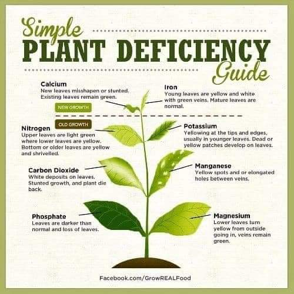
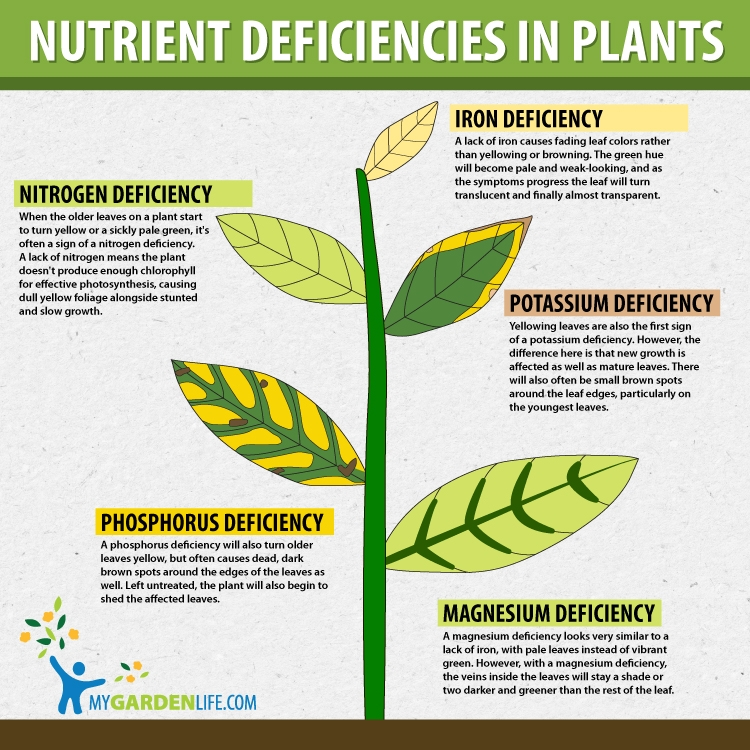

9th June 2022

_On the farm_

* 12-24-12 (NPK) fertilizer used initially to promote root growth (High Phosphorous)

* The fertilizer was placed between plants so that the rain can disperse it between plants

* _Fountain-tube irrigation_ creates a spout of water, placed between every 2 beds.

* _Bioforge_ decreases ethylene production in plants (stress increases ethylene and leads to plants dying)

* worms make holes in the middle of leaves
* ants eat away the outside of leaves

* _Drenching_ applying nutrients to the roots

Herbicides
* _Selective_ - eg only broadleaf/straight leaf etc
* _Contact_ - anything it touches
* _Pre-emergent_ - kills seeds when they start to grow and touch the layer.

Should inspect the crops daily, look for anything out of the ordinary such as color, insects, or holes.

