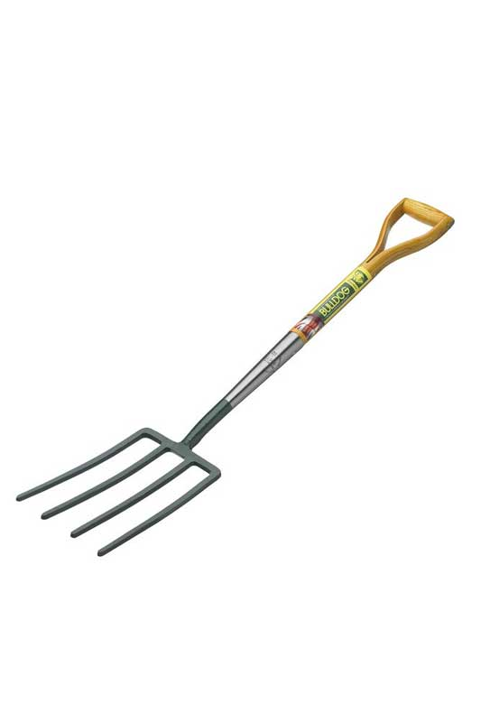

# Identification of basic agricultural tools/equipment and maintenance

# Farm Equipment

**Farm equipment** is any kind of **machinery** used on a farm to help with farming.

## Traction and power

A **tractor** is a farm vehicle. 

Implements may be towed behind or mounted on the tractor. The tractor may also provide a source of power.

A farm tractor is used for pulling or pushing agricultural machinery or trailers for 
* ploughing
* tilling
* disking
* harrowing
* planting

## Soil cultivation

* A **cultivator** is used for stirring and pulverizing the soil before planting or to remove weeds and aerate and loosed the soil after the crop has begun to grow.

	It is powered by a tractor.

* A **plough** is used for initial cultivation of soil in preparation for sowing/planting.

	Turns over the upper layer of the soil, bringing fresh nutrients to the surface, while burying weeds and the remains of previous crops.
	It also aerates the soil and allows it to hold moisture better.

* A (set of) **harrows** cultivates the surface of the soil. Often carried out on fields to follow the rough finish left by ploughing operations.

	Breaks up lumps of soil. Can also remove weeds and cover seeds after sowing.

	* spike
	* drag
	* disk

* A **rotary tiller** (rototiller, rotavator, rotary hoe, power tiller, rotary plough) is a motorized cultivator that works the soil by beans of rotating tines or blades. 

	Can be self propelled or drawn as an attachment behind a tractor.

## Planting

* A **broadcast seeder** (broadcast spreader/fertilizer spreader) is a tractor implement commonly used for spreading seed, lime, or fertilizer.

* **Seed drill** sows seeds evenly over the entire surface.

	Needs a machine that pulls it.

---

# Tools and Equipment

## Tools

Any physical item that is used to achieve a goal but is not consumed during the process can be defined as a tool.
Most tools serve a combination of uses.

### Importance of Tools

* Reduced labor work
* Easier work
* Individuals able to produce required quantities
* Helps farmers economize capital and labor costs

## Equipment

Represents all sorts of machinery, functional devices or accessories which serve an individual, household, or community purpose. Usually a set of tools that are designated for a specific task is known as equipment.

## Differences between Tools and Equipment

* Tools are usually multipurpose. Equipment are designed for specific tasks.
* Tool usage runs back millions of years. Equipment use is more of a recent development
* A tool is any item used to achieve a goal. Equipment denotes a set of tools that are used to obtain a specific objective
* A tool can be non-mechanical.

## Agricultural Practices

* Nursery/seedling preparation
* Digging for planting
* Intercultural Operations
* Aeration
* Land Preparation
* Irrigation/Drainage
* Plant Protection
* Harvesting
* Post Harvest Operations

## Identification of Tools

<!-- * **Hand Trowel**  
	

	

* **Secateurs**  

	Also known as pruning shears, pruners or clippers. Used for pruning and harvesting of crops.

	 -->

| Tool | Description | Image |
| --- | --- | --- | 
| **Hand Trowel** | Used for planting, transplanting, and potting. Get one with sturdy connection between blade and handle. |  |
| **Secateurs** | Also known as pruning shears, pruners or clippers. Used for pruning and harvesting of crops. |  |
| **Hedge Shears** | Allows trimming of hedges easily. Like large scissors. |  |
| **Budding Knife** | Small knife with a type of spatula at the end. Allows for an incision to be bade on branches or trunk of the rootstock for insertion of graft | 
| **Garden Hoe** | Used for cultivating soil, edging lawn, etc. Helpful in preparing beds for planting and weeding. |  |
| **Fork** | Can be used to aerate lawns, break up compacted soil, create holes for seeds, mix in soil treatment, remove stones and weeds, and soften touch ground. Can more easily penetrate difficult terrain than a spade. |  |
| **Spade** | Long handle and a long, narrow, flat head. Used for digging tasks as well as edging beds and lawns, etc. |  |
| **Shovel** | Used for digging, lifting, and moving bulk materials. | 
| **Rake** | Removes stones, rocks, and clogs from ground before planting. Also used for levelling and smoothing the surface of the soil, or gathering debris such as leaves and weeds. |  |
| **Post Hole Digger** | Used to dig holes about a few inches to a foot in diameter. | 

## Care and Maintenance

**Rust** forms when iron/steel is left exposed to water and oxygen.

Steps:

* Always remove all soil from digging tools after each use. Hosing or screwdriver to remove caked or dried mud.

* Never put tools away wet. Allow to dry completely. Use linseed oil in wooden handles to preserve them, once each season.

* Wipe metal parts of pruners, shears, and loppers with an oily rag after each use. Or wipe with clean rag and spray with WD40.

* Sharpen cutting tools as well as blades of shovels and spades during gardening season (hone or whetstone). Remove nicks with file.

* Thoroughly clean any tools used for chemical applications.

### Advantages of care and maintenance

* Increased equipment up-time
* Enhances efficiency when running.
* Reduces overall costs.
* Improves the lifespan of the equipment.
* Maintains the value of the equipment.

| Equipment | Description | Image | 
| --- | --- | ---| 
| **Grader** | Construction and maintenance of dirt and gravel roads or creating a flat surface. May be used to create drains. |  |
| **Rotary Cutter** | Often pulled behind a tractor and powered by the PTO. Uses thick blades of sharpened metal to cut thick grass, heavy bushes, weeds and small trees. |  | 
| **Disc Plough** | Moving circular steel discs of varying sizes. Discs cut, turn, and break furrow slices. Work well in sticky soil as well as hard and dry soil. Primary tillage. |  |
| **Harrow** | Preparation of finer soil by breaking clods, cutting weeds, pulverizing the soil surface. Can be disc, spike, spring, or blade types. |  | 
| **Chisel Plough** | Breaking hard pans and for deep ploughing (60-70 cm) with less disturbance to top layers. |  |
| **Rotovator** | Stirring and pulverizing the soil before planting to remove wees and to aerate and loosen the soil after the crop has begun to grow. Secondary tillage. |  |
| **Banker** | Blades on both sides that pull the soil to the center forming banks 2-3 feet in width. |  | 
| **Drainer** | Creates drains by the use of rotating blades powered by the PTO. |    |
| **Boom Sprayer** | Most common apparatus for applying pesticides in broadscale farming. |  |

